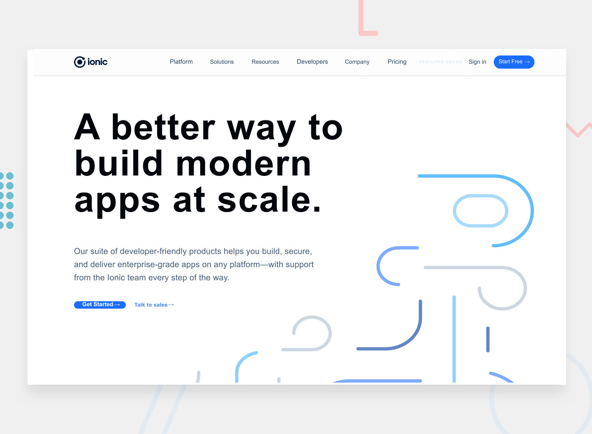

# Art Sled - Ionic website (path)

## Welcome! 👋

[Art Sled](https://github.com/sledua) Front-end application developer, and constantly strengthening his hard skills in development. 

**Ionic is a cross-platform development site that will help me strengthen my knowledge of (Front-end Stuff). And by itself here is the primary source for the layout [Figma/Ionic](https://www.figma.com/file/tdamAsyBWlO7qyt1b7gmEN/ionic?node-id=2%3A2). And I ask you to view the resulting result [gh-pages](https://github.com/sledua/t-ionic)**

## The challenge

**Have fun building!** 🚀